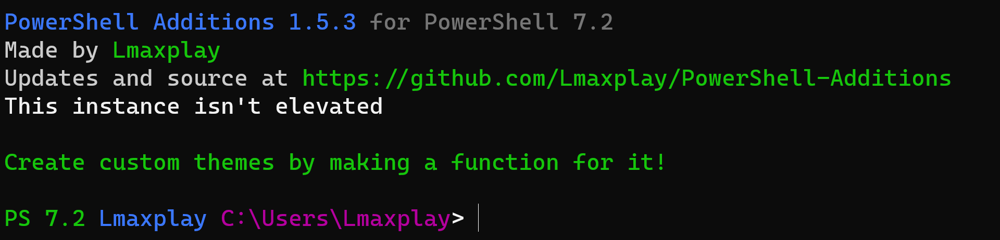
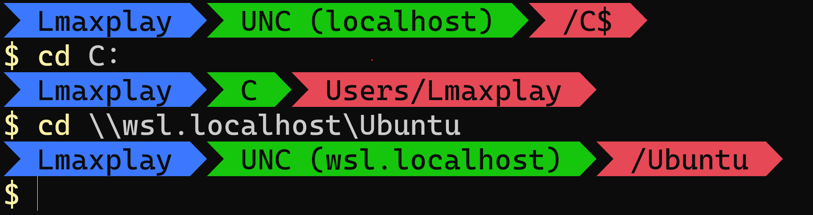

# PowerShell Additions

## Because PowerShell lacks some features we need

100% vanilla compatible!

## Q & A

Q: Why should I use this  
A: It allows theming and is made in 100% PowerShell, so no slowdown?

Q: Does it work on linux?  
A: No, it doesn't (at least for ubuntu)

Q: Why doesn't it work on linux?
A: Most people don't use PowerShell on linux, so it isn't a priority for the project developer(s)

Q: Will I backport this to older versions?  
A: No, I won't, as its too much trouble to check it for every version

Q: How do I install?  
A: Download/copy the repo, and run install.ps1, this will copy the profile.ps1 file into your powershell folder (along with any neccessary files)

Q: Will this break software
A: No it won't, if software were to use conflicting variable/function names it will be overwritten anyways

Q: Is it safe
A: Yes

Q: A program using PowerShell suddenly stops working, what can I do?
A: When using powershell in a non-interactive prompt, use `pwsh -NoProfile -NonInteractive`, contact the app devs if they don't do this

Q: How do I use custom themes?  
A: Run `Set-Theme THEME_<THEMENAME>`/`Set-Theme <functionname>`

Q: Why are there global variables whose name start with \_\_ and end in \_\_  
A: These are variables that shouldn't be modified directly, avoid editing these (It may break themes)

Q: How do I report bugs?
A: The way you report bugs on GitHub repo's (issues tab)

Q: How do I remove?
A: Delete `<userfolder>/Documents/PowerShell`
