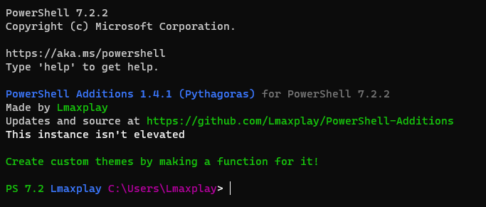

# PowerShell Additions

## Because PowerShell lacks some features we need

100% vanilla compatible!

"

## Q & A

Q: Why should I use this  
A: It makes PowerShell more fancy and adds Quality-Of-Life features

Q: Does it work on linux?  
A: Yes, it does (at least for ubuntu)

Q: Will I backport this to older versions?  
A: No, I won't, as its too much trouble to check it for every version

Q: How do I install?  
A: Download the repo, and run install.ps1, this will copy the profile.ps1 file into your powershell folder

Q: How do I use custom themes?  
A: Do `Set-Theme THEME_<THEMENAME>`/`Set-Theme <functionname>`

Q: Why are there global variables whose name start with \_\_ and end in \_\_  
A: These are variables that shouldn't be modified directly, avoid editing these
